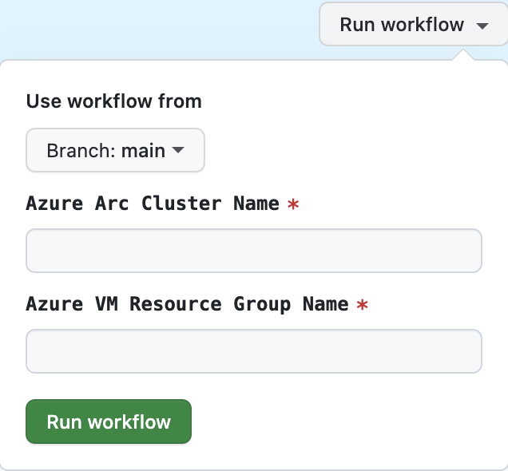

# Optimization for Arc memory footprintview

This repository sets up the infrastructure to create vhdx images and VMs for the Arc memory footprint investigations.
Because of the nature of efficiency, customers demand a low memory footprint to save costs in terms of hardware and devices.
This infrastructure enables you to install instrumentation tools and collect memory dumps components.

## Getting Started

### Prerequisites

1. Install [Azure CLI](https://docs.microsoft.com/en-us/cli/azure/install-azure-cli?view=azure-cli-latest)
2. Install [GitHub CLI](https://cli.github.com/)
3. An Azure subscription
4. Fork this repository and run

`az login --tenant <tenant-id>`

`az account set --subscription <subscription-id>`

### Setup

Execute the PowerShell script [`./setup.ps1`](./setup.ps1):

```powershell
./setup.ps1 -ForkedRepo <owner/forked-repo-name> -SubscriptionId <subid> -ServicePrincipalName <name-for-new-sp> -VmAdminUsername <vm-usrname>

# or 
./setup.ps1 <owner/forked-repo-name> <subid> <name-for-new-sp> <vm-usrname>
```

to create the required Service Principal, Role Assignments and GitHub Secrets.

You have to provide the following parameters to the script:

- Azure Subscription Id
- Service Principal Name
- VM Admin Username (for the VMs created based on the images)
- VM Admin Password (for the VMs created based on the images)

<details>

  <summary>The script executes the steps described in the following sections:</summary>

### Azure Subscription Access

```sh
# Create an sp for gh actions. Create a secret named AZURE_CREDENTIALS from the output of the following command
# Owner role required to create identities
az ad sp create-for-rbac --name "myApp" --role owner \
                                --scopes /subscriptions/{subscription-id}/resourceGroups/{resource-group} \
                                --json-auth
```

Due to flexibility reasons, the output JSON of the above command doesn´t need to be stored.
Instead, you have to store the single properties subscriptionId, tenantId, clientId, clientSecret and objectId in separate secrets named `AZURE_SUBSCRIPTION_ID`, `AZURE_TENANT_ID`, `AZURE_SP_CLIENT_ID`, `AZURE_SP_CLIENT_SECRET` and `AZURE_SP_OBJECT_ID` in the GitHub repository.

You can obtain the objectId by executing the following command:

```sh
# Get the objectId of the sp
az ad sp show --id <client-id> --query id -o tsv
```

```sh
# Create role assignment for the SP to create Grafana dashboards
az role assignment create --assignee <client-id> --role "Grafana Admin" --scope /subscriptions/<subscription-id>
```

### GitHub Secrets

GitHub secrets that are required for the workflows to run:

| Secret | Description |
| ------------- | ------------- |
| AZURE_SUBSCRIPTION_ID | subscription id (also part of the output from az ad sp create-for-rbac command) |
| AZURE_TENANT_ID | tenant id (also part of the output from az ad sp create-for-rbac command) |
| AZURE_SP_CLIENT_ID | client id from az ad sp create-for-rbac command |
| AZURE_SP_CLIENT_SECRET | client secret from az ad sp create-for-rbac command |
| AZURE_SP_OBJECT_ID | object id from az ad sp create-for-rbac command |
| CUSTOM_LOCATIONS_OBJECT_ID | object id of the contributor SP (see below) |
| VMADMINPASSWORD | admin username for the VM |
| VMADMINUSERNAME | admin password for the VM |

### Arc Custom Locations

In order to enable [Arc custom locations](https://learn.microsoft.com/en-us/azure/azure-arc/platform/conceptual-custom-locations), the service principle created for the workflow must have the ability to read Applications in Microsoft Graph. 

Since this requires admin consent, you also execute the following command to obtain the required objectId of the `Contributor` role in that Azure tenant by using a user/service principle having the permission mentioned above.

```sh
az ad sp show --id bc313c14-388c-4e7d-a58e-70017303ee3b --query id -o tsv
```

You need to store the command output in a secret name `CUSTOM_LOCATIONS_OBJECT_ID` in the GitHub repository.

</details>

## Pre-requisites

### Azure VM Sizes

Since nested virtualization is required to install AKS-EE on Windows, you need to select a VM size that supports this feature, such as Dv5 or Dsv5 series. For more information, you can refer to [hardware requirements](https://learn.microsoft.com/en-us/azure/aks/hybrid/aks-edge-system-requirements#hardware-requirements).

## Workflows

### Image Creation

Once you enabled the GitHub Action workflows you can run the **Build VHDX** pipeline to create the vhdx images based on the selected parameters and configuration.
It installs the corresponding version of [AKS-EE](https://learn.microsoft.com/en-us/azure/aks/hybrid/aks-edge-overview) directly on the os disk/image for a Windows os type. For a Linux os type, it installs [K3s](https://docs.k3s.io/quick-start) lightweight Kubernetes cluster.

#### How to create a new image

Just navigate to the GitHub Actions of the repository and select the **Build VHDX** workflow. You can now start a workflow run by clicking on the **Run workflow** button and specifying all parameters and the image configuration.
If you check the **Create VM from image** checkbox, the workflow will automatically create a VM from image by starting the **Build VM** pipeline.


### VM Creation

On top of the created vhdx images you can create a VM with the **Build VM** pipeline that references the image in the image gallery.
It also sets up a VM extension that connects the Cluster to the Arc control plane and installs [Azure IoT Operations](https://learn.microsoft.com/en-us/azure/iot-operations/).

> **Note:** The VM creation workflows targets to create virtual machines in an Azure subscription. If you want to create Industrial PCs in a different environment or on-premise, you need to modify the workflow.

#### How to build a new VM

As mentioned in section [How to create a new image](#how-to-create-a-new-image), you can implicitly run the **Build VM** pipeline by checking the **Create VM from image** checkbox for the **Build VHDX** workflow.
But you can also start a workflow run manually by submitting the right parameters to point to an existing image. Due to reusability of os disks you can create multiple VMs based on the same image.
Monitoring resources creation is automatically triggered via separate pipeline, see [Monitoring](#monitoring) section for more details.


### Monitoring

Azure Monitoring resources like Log Analytics and Grafana are created by the **Build Monitoring** pipeline. This workflow is automatically triggered by the **Build VM** pipeline but you have the chance to manually run it as well.
You can also run the **Build Monitoring** workflow manually to create monitoring resources for an existing cluster.

> Note: This pipeline will skip installing the azuremonitor-extension for arc-clusters if the provided cluster is not found



#### Grafana Dashboard

After running the Build-VM (or manually running the Build-Monitoring) pipeline, you should be equipped with a Grafana dashboard. In order to access the dashboard, users must have at least "Grafana Reader" role.

```sh
# Assign the signed-in user appropriate Grafana role with az cli
id=$(az ad signed-in-user show --query id -o tsv)
az role assignment create --assignee $id --role "Grafana Admin"
```
#### Hostmem Usage

To view memory usage per process. Navigate to the Log Analytics workspace and run queries against the ResidentSetSummary_CL table. Note it may take some time for metrics to appear. 
